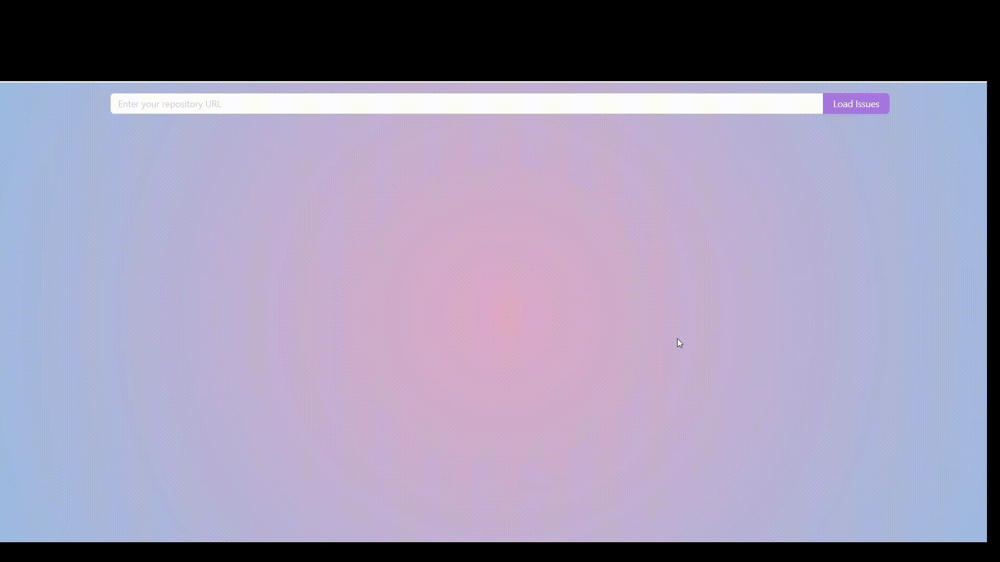

# Github Kanban Board

## Overview

User can enter repo URL in the input on top of the page and press "Load". For example: `https://github.com/facebook/react`. If URL is not valid, input turns red.

App loads issues for the repo using Github API and contains 3 columns:

- ToDo (all new issues)
- In Progress (opened issues with assignee)
- Done (closed issues)

User is able to drag-n-drop between the columns and change the order of issues.

## Technologies

- React 18 with hooks
- TypeScript
- UI library:
  - Ant Design
- State manager
  - Redux (or Redux-Toolkit)
- Testing (not yet, but soon):
  - React Testing Library
- Other:
  - dnd kit (drag & drop)
  - styled-components
  - ESLint + eslint-plugin-simple-import-sort
